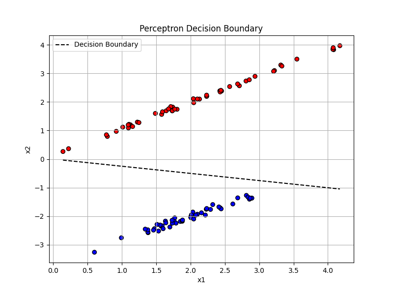

# 感知器模型详解与可视化推导

## 一、感知器模型简介

感知器（Perceptron）是最早的神经网络模型之一，由 Frank Rosenblatt 在 1958 年提出，主要用于解决线性可分的二分类问题。

### 感知器的基本形式

给定输入向量 $\mathbf{x} \in \mathbb{R}^n$ 和权重向量 $\mathbf{w} \in \mathbb{R}^n$，感知器的输出由以下公式确定：

$$
f(\mathbf{x}) = \text{sign}(\mathbf{w}^T \mathbf{x} + b)
$$

其中：
- $\mathbf{w}$ 是权重向量
- $b$ 是偏置项
- $\text{sign}(\cdot)$ 是符号函数，返回 +1 或 -1

感知器的目标是找到合适的 $(\mathbf{w}, b)$ 使得对所有训练样本 $(\mathbf{x}_i, y_i)$ 有：

$$
y_i (\mathbf{w}^T \mathbf{x}_i + b) > 0
$$

## 二、感知器的训练过程

感知器的训练过程是一个迭代更新的过程：

1. 初始化权重 $\mathbf{w}=\mathbf{0}$，偏置 $b=0$
2. 对于每个训练样本 $\mathbf{x}_i$，若有分类错误（即 $y_i(\mathbf{w}^T \mathbf{x}_i + b) \leq 0$），则更新：

$$
\mathbf{w} \leftarrow \mathbf{w} + \eta y_i \mathbf{x}_i
$$

$$
b \leftarrow b + \eta y_i
$$

其中 $\eta$ 是学习率，通常设为 $1$。

## 三、代码实现与可视化

### 1. 感知器训练代码（带偏置）以及可视化与测试数据代码

```python
import numpy as np
import matplotlib.pyplot as plt
from sklearn.datasets import make_classification

def perceptron_train(X, y, max_iter=1000):
    n_samples, n_features = X.shape
    w = np.zeros(n_features)
    b = 0

    for _ in range(max_iter):
        error_found = False
        for i in range(n_samples):
            if y[i] * (np.dot(w, X[i]) + b) <= 0:
                w += y[i] * X[i]
                b += y[i]
                error_found = True
        if not error_found:
            break
    return w, b


# 生成线性可分的二维数据
X, y = make_classification(n_samples=100, n_features=2, n_redundant=0,
                           n_clusters_per_class=1, class_sep=2.0, random_state=42)
y = 2 * y - 1  # 将标签变成 {-1, 1}

# 训练模型
w, b = perceptron_train(X, y)

# 可视化
plt.figure(figsize=(8,6))
plt.scatter(X[:, 0], X[:, 1], c=y, cmap='bwr', edgecolors='k')
x1 = np.linspace(min(X[:, 0]), max(X[:, 0]), 100)
x2 = -(w[0] * x1 + b) / w[1]
plt.plot(x1, x2, 'k--', label='Decision Boundary')
plt.legend()
plt.title('Perceptron Decision Boundary')
plt.xlabel('x1')
plt.ylabel('x2')
plt.grid(True)
plt.show()

```
### 2.程序运行结果 


### 3.感知机算法实现与可视化说明
上述代码实现了经典的感知机（Perceptron）算法，用于对二维线性可分的数据进行二分类学习。首先，代码通过 sklearn.datasets.make_classification 生成了一个包含两类样本的二维数据集，并将标签调整为感知机算法所需的 ${-1, 1}$ 形式。接着，perceptron_train 函数通过迭代训练权重向量 $\mathbf{w}$ 和偏置 $b$，直到所有样本被完全正确分类或达到最大迭代次数。

最终，代码利用 matplotlib 对结果进行可视化。图中展示了：
    两类样本点，使用红色（$y = -1$）和蓝色（$y = +1$）区分；
    一条由学习到的参数 $\mathbf{w}, b$ 确定的线性决策边界，以黑色虚线表示。

由于生成的数据是线性可分的，图像中可以看到感知机成功找到了一个将两类样本完全分开的直线，验证了感知机在理想条件下的有效性。

## 四、数学推导与图示解释

### 1. 感知器算法的核心思想
- 每次错误分类时，将样本向量沿其标签方向加到当前权重上，逐步使错分样本"推向"超平面另一侧
- 几何上是不断调整分隔超平面，直到所有样本线性可分

### 2. 感知器损失函数
虽然标准感知器算法不使用显式损失函数，但可以引入如下形式的损失：

$$
L(\mathbf{w}, b) = -\sum_{i \in \mathcal{M}} y_i (\mathbf{w}^T \mathbf{x}_i + b)
$$

其中 $\mathcal{M}$ 是分类错误的样本索引集合。

通过梯度下降法可得感知器的更新规则。

## 五、感知器收敛性定理（Perceptron Convergence Theorem）

### 定理内容
如果训练数据是线性可分的，感知器算法在有限次迭代后一定会停止。

### 关键定义
- 设存在$\mathbf{w}^\*$, $b^\*$，使得对所有训练样本有：
  $$
  y_i (\mathbf{w}^{\*T} \mathbf{x}_i + b^\*) > 0
  $$

- 定义几何间隔为：
  $$
  \gamma = \min_i \frac{y_i (\mathbf{w}^{\*T} \mathbf{x}_i + b^\*)}{\|\mathbf{w}^\*\|}
  $$

- 定义样本范数上界：
  $$
  R = \max_i \|\mathbf{x}_i\|
  $$

### 收敛性推导概要

每次权重更新：
$$
\mathbf{w}_{t+1} = \mathbf{w}_t + y_i \mathbf{x}_i
$$

考虑 $\mathbf{w}_t \cdot \mathbf{w}^*$ 逐步增加，利用 Cauchy-Schwarz 不等式和向量内积展开，可得更新次数满足：
$$
T \leq \left(\frac{R}{\gamma}\right)^2
$$

### 结论
感知器在 $\left(\frac{R}{\gamma}\right)^2$ 次内必然收敛。

## 六、进一步学习方向

1. **非线性扩展**：将输入映射到高维空间，如核感知器、支持向量机（SVM）
2. **多类别分类**：原始感知器只处理二分类，需扩展成 One-vs-Rest 或 Softmax 感知器
3. **与现代神经网络连接**：感知器是现代深度学习的雏形，深入理解有助于掌握 MLP、ReLU 等结构

## 七、总结

- 感知器是处理线性可分问题的经典算法
- 具有明确的几何解释和可视化
- 在数学上可证明其收敛性
- 是理解现代神经网络的基石

如果你对本文内容中的某部分代码、公式推导或可视化仍有疑问，可继续展开学习或提问。
