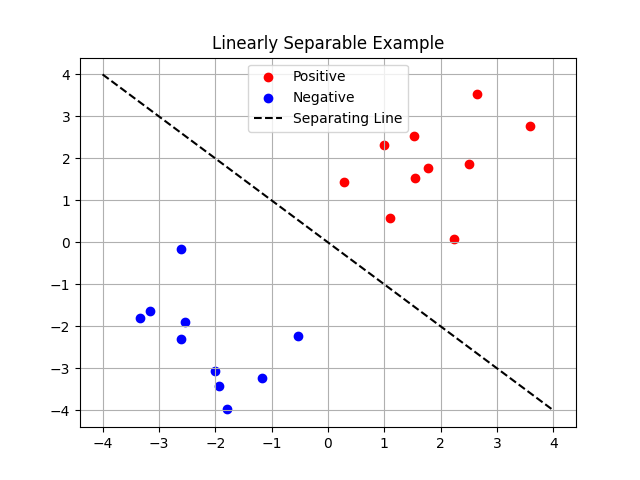

# 线性可分的二分类问题详解

## 一、问题背景

在二分类任务中，我们的目标是将输入空间中的样本分为两类，常记为类别 +1 和 -1。线性可分（Linearly Separable）是指存在一个超平面，能够将这两类样本完全正确地分开。

## 二、形式化定义

设有一组训练样本：

$$
\mathcal{D} = \{ (\mathbf{x}_i, y_i) \mid \mathbf{x}_i \in \mathbb{R}^d, y_i \in \{+1, -1\}, i = 1, \dots, N \}
$$

其中，$\mathbf{x}_i$ 是特征向量，$y_i$ 是类别标签。

线性分类器的形式为：

$$
f(\mathbf{x}) = \mathbf{w}^\top \mathbf{x} + b
$$

其中，$\mathbf{w} \in \mathbb{R}^d$ 是权重向量，$b \in \mathbb{R}$ 是偏置。

## 三、线性可分的数学条件

样本线性可分 ⇔ 存在一组参数 $(\mathbf{w}, b)$，使得对所有训练样本满足：

$$
y_i (\mathbf{w}^\top \mathbf{x}_i + b) > 0, \quad \forall i
$$

含义是：
- 如果 $y_i = +1$，则要求 $\mathbf{w}^\top \mathbf{x}_i + b > 0$
- 如果 $y_i = -1$，则要求 $\mathbf{w}^\top \mathbf{x}_i + b < 0$

也就是说，样本在超平面 $f(\mathbf{x}) = 0$ 的同一侧上分别对应一个类别。

## 四、几何解释

### 1. 超平面

$$
\mathbf{w}^\top \mathbf{x} + b = 0
$$

是一个 $d-1$ 维的超平面（二维中是直线，三维中是平面），它将样本空间划分为两个半空间。

### 2. 分隔边界
- 样本位于超平面一侧 ⇒ 被分为一类
- 位于另一侧 ⇒ 被分为另一类

### 3. 距离含义（几何间隔）
一个样本 $\mathbf{x}_i$ 到超平面的距离为：

$$
\gamma_i = \frac{|\mathbf{w}^\top \mathbf{x}_i + b|}{\|\mathbf{w}\|}
$$

更大的几何间隔 ⇒ 更"稳定"的分类。

## 五、图示代码说明

```python
import numpy as np
import matplotlib.pyplot as plt

# 创建线性可分数据
np.random.seed(42)
X_pos = np.random.randn(10, 2) + [2, 2]
X_neg = np.random.randn(10, 2) + [-2, -2]
X = np.vstack((X_pos, X_neg))
y = np.array([1]*10 + [-1]*10)

# 绘图
plt.scatter(X_pos[:, 0], X_pos[:, 1], color='red', label='Positive')
plt.scatter(X_neg[:, 0], X_neg[:, 1], color='blue', label='Negative')
plt.plot([-4, 4], [4, -4], 'k--', label='Separating Line')
plt.legend()
plt.title("Linearly Separable Example")
plt.grid(True)
plt.show()
```



- 正样本：红点
- 负样本：蓝点
- 分类超平面：一条直线
- 正确划分：红点在直线一侧，蓝点在另一侧 ⇒ 线性可分
- 若存在交叉点 ⇒ 线性不可分
图中用虚线展示一个能够完全分开的直线，代表线性可分。

## 六、线性可分与感知器算法的关系

感知器算法的收敛性要求数据是线性可分的。即感知器能在有限步内找到使：

$$
y_i(\mathbf{w}^\top \mathbf{x}_i + b) > 0
$$

成立的参数。

## 七、总结

- 线性可分是分类模型的重要假设基础，特别适用于感知器、SVM（线性核）等模型
- 判断是否线性可分，可通过可视化或尝试训练线性模型观察收敛情况
- 若不满足线性可分，需引入非线性模型或特征映射（如核技巧）
