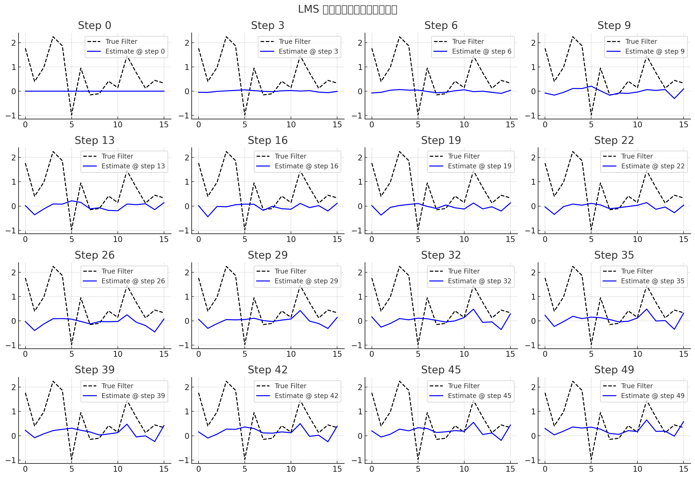
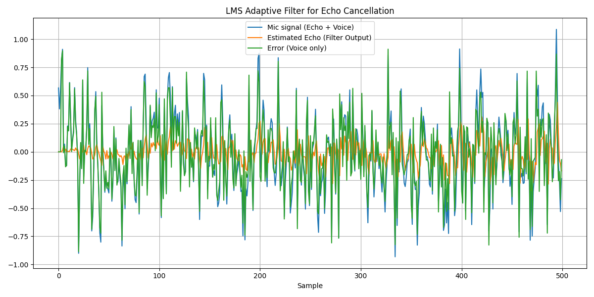

# 自适应滤波器与回声消除（AEC）原理详解

## 核心原理

自适应滤波器之所以能够用于回声消除（AEC），核心原因在于它可以动态估计并还原"回声路径"，然后将这一估计出的回声信号从麦克风输入中减去，从而实现回声的抑制甚至消除。

### 原理简述 🧠

在回声消除系统中，自适应滤波器会根据扬声器输出（远端信号）来预测它在麦克风中会出现的形式（回声），然后从实际的麦克风输入中减去这个预测的信号。

### 基本信号模型 📦

设：
- `x(n)`：远端信号（扬声器播放）
- `d(n)`：麦克风信号（含近端语音 + 回声）
- `y(n)`：自适应滤波器输出（回声的估计）
- `e(n)`：误差信号（d(n) - y(n)，理论上就是近端语音）

自适应滤波器目标是：
$$
y(n) ≈ 回声分量 = x(n) * h(n)
$$
其中 `h(n)` 是回声路径（扬声器到麦克风的模拟传输特性，可能包含混响、设备响应等）。

最终：
$$
e(n) = d(n) - y(n) ≈ 近端语音
$$

### 自适应滤波器工作机制 ⚙️

- 使用如 LMS（Least Mean Square）或 NLMS 算法，通过最小化 e(n) 的能量来不断更新滤波器系数
- 当估计越来越准时，y(n) 趋近于回声，e(n) 就接近纯近端语音

### 为什么它能成功 🔍

1. **因果建模**：回声路径是因果的，即某时刻的扬声器输出 x(n) 会在未来若干毫秒后以回声的形式出现在麦克风中
2. **线性建模有效**：大多数设备在一定条件下，其声学路径可以较好地用线性模型（FIR 滤波器）表示
3. **反馈优化**：误差信号 e(n) 反馈用于更新滤波器参数，不断逼近真实的回声路径响应

### 挑战情况 🚫

- **双讲问题**：远近端同时说话时，远端信号和近端语音混合后，误差信号不再纯粹代表回声误差，滤波器容易被误导
- **非线性失真**：如设备中存在非线性放大、限幅等，使得简单线性滤波器难以完全建模

## LMS 算法详解

LMS（Least Mean Squares，最小均方）算法是一种自适应滤波算法，它通过不断调整滤波器的系数，使得输出信号尽可能逼近目标信号（期望信号）。

### LMS 的核心思想 🧠

在每一帧音频数据处理时，LMS 算法执行以下步骤：

1. **获取参考信号 x(n)**
   - 这是扬声器播放出去的音频（远端信号），作为"回声来源"

2. **通过自适应滤波器预测回声 ŷ(n)**
   $$
   ŷ(n) = w(n)^T · x(n)
   $$
   - w(n)：当前时刻的滤波器权重（即回声通道估计）
   - x(n)：过去若干个远端信号组成的向量

3. **计算误差信号 e(n)**
   $$
   e(n) = d(n) - ŷ(n)
   $$
   - d(n)：麦克风采集到的信号（包含人声 + 回声）
   - e(n)：我们希望最终听到的纯净人声信号

4. **更新滤波器权重**
   $$
   w(n+1) = w(n) + μ · e(n) · x(n)
   $$
   - μ 是学习率（控制更新幅度，太大不稳定，太小收敛慢）

### 符号说明 📌

| 符号 | 含义 |
|------|------|
| x(n) | 当前及过去远端样本向量 |
| w(n) | 滤波器系数，模拟声道 |
| ŷ(n) | 估计回声 |
| d(n) | 麦克风采集的混合信号 |
| e(n) | 误差，即人声估计值 |
| μ | 步长（学习率）|

## 收敛过程详解 🌀

回声消除不可能一开始就"完美"，必须依靠一个"收敛"的学习过程。这个过程本质上是一个迭代优化过程，自适应滤波器逐步"学会"回声通道的特性。

### 1. 初始状态：一无所知 ✅

- 刚开始时，滤波器权重 w(n) 是全 0 或随机初始化
- 滤波器无法估计出真实的回声，只能输出很差的 ŷ(n)
- 结果就是：减去的回声信号不准确，误差 e(n) 很大

### 2. 梯度反馈：误差驱动更新 ✅

- LMS 核心公式：
  $$
  w(n+1) = w(n) + μ · e(n) · x(n)
  $$
- 根据当前的误差 e(n) 和远端信号 x(n)，来更新滤波器参数 w(n)
- 目标是：让下一次输出的回声预测 ŷ(n+1) 更接近真实回声

### 3. 持续训练：不断迭代靠近目标 ✅

收敛条件要求：
- 学习率 μ 不过大（否则震荡）
- 有足够"丰富"的远端语音输入 x(n)
- 没有强干扰

当这些条件满足时，误差 e(n) 会越来越小，权重 w(n) 趋于稳定。

### 4. 收敛后的效果 ✅

- 滤波器已经基本"拟合"出房间的回声通道
- 对于新到的远端音频信号，滤波器能准确预测出其回声
- 将其从麦克风信号中减掉后，剩下的主要就是人声

### 收敛依赖条件 🔁

| 条件 | 影响 | 举例 |
|------|------|------|
| 学习率 μ | 控制收敛速度和稳定性 | 太大会震荡，太小会慢 |
| 远端信号丰富性 | 提供"训练数据" | 远端语音内容越多越稳定越好 |
| 麦克风信号质量 | 保证误差信号有意义 | 加噪严重会影响误差计算 |
| 回声路径稳定 | 环境变化越小越容易收敛 | 移动手机、音量突变等会打断学习 |

## 数学推导与实例 🔢

💬 为什么这很奇妙？

因为 AEC 像是"机器在学习听觉模式"：
它从完全不了解这个房间的回声结构，在无监督的情况下，通过每一帧误差，自己慢慢"摸索"出房间、麦克风、扬声器之间的关系，构建出一套自己的"回声模型" —— 这是一个高度自适应的行为，跟人类在听觉学习中很像。

一步一步地从数学角度推导出 LMS 在回声消除中是如何工作的，包括：
1. 自适应滤波器结构
2. 回声估计与误差计算
3. 权重更新（带学习率）
4. 简单数值示例演示"收敛"过程

🧠 一、基本模型结构

假设我们使用一个长度为 N 的 FIR 滤波器来估计回声：
- x(n)：当前帧远端信号
- x(n-1), x(n-2), ..., x(n-N+1)：历史帧构成一个信号窗口
- w(n)：滤波器权重（系数）

回声估计：

$$
\hat{y}(n) = \sum_{i=0}^{N-1} w_i(n) \cdot x(n-i)
$$

误差信号：

$$
e(n) = d(n) - \hat{y}(n)
$$

其中 d(n) 是近端麦克风采集的信号（人声 + 回声），e(n) 应该是近端人声。

📘 二、LMS 更新公式

为了让估计的回声更接近实际的回声，我们用误差信号 e(n) 来更新 w(n)：

$$
w_i(n+1) = w_i(n) + \mu \cdot e(n) \cdot x(n-i)
$$

其中：
- μ 是学习率，控制更新的速度（通常是 0.001 ~ 0.01 之间的小数）
- x(n-i) 是过去的远端信号样本
- e(n) 是当前误差信号

🔢 三、简单数值演示

假设我们用一个长度为 3 的滤波器（N=3）来估计回声。

条件设定：
- 初始权重 w = [0, 0, 0]
- 学习率 μ = 0.1
- 某一时刻远端信号 x(n), x(n-1), x(n-2) = [1.0, 0.5, -0.3]
- 近端麦克风采集到的信号（含回声）d(n) = 0.8

第一步：估计回声 ŷ(n)

$$
\hat{y}(n) = 0 \cdot 1.0 + 0 \cdot 0.5 + 0 \cdot (-0.3) = 0
$$

第二步：计算误差

$$
e(n) = d(n) - \hat{y}(n) = 0.8 - 0 = 0.8
$$

第三步：更新权重

$$
w_0(n+1) = 0 + 0.1 \cdot 0.8 \cdot 1.0 = 0.08 
$$

$$
w_1(n+1) = 0 + 0.1 \cdot 0.8 \cdot 0.5 = 0.04 
$$


$$
w_2(n+1) = 0 + 0.1 \cdot 0.8 \cdot (-0.3) = -0.024
$$

所以新的权重是：
$$
w(n+1) = [0.08, 0.04, -0.024]
$$

第二帧到来时

只要继续新的远端样本、对应的近端采样信号，重复上面过程，就会不断更新权重。随着时间推移，权重会逐步逼近真实的房间回声路径系数。

📈 收敛的数学视角
- LMS 是在最小化误差平方：E[e(n)^2]
- 它其实是在做随机梯度下降（SGD），寻找最优 w 使误差最小
- 收敛条件取决于：
  - μ < 1 / (3 × 输入信号功率)
  - 输入信号需满足"持久激励"（丰富）

💡 关键数学过程解释：

1. 输入信号 x[n]：

这是远端播放的信号，即扬声器发出的声音。

2. 回声信号 d[n]：

由真实的回声路径 true_filter 卷积生成，并加入噪声。也就是说，d[n] 是麦克风采集的信号（不含近端人声），形如：

$$
d[n] = \sum_{i=0}^{L-1} h[i] \cdot x[n-i]
$$

3. 滤波器估计输出 ŷ[n]：

$$
\hat{y}[n] = \sum_{i=0}^{L-1} w[i] \cdot x[n-i]
$$

4. 误差信号 e[n]：

$$
e[n] = d[n] - \hat{y}[n]
$$

这是我们要最小化的量。

5. LMS 权重更新公式：

$$
w_{i}[n+1] = w_{i}[n] + \mu \cdot e[n] \cdot x[n-i]
$$

- μ 是学习率，控制收敛速度与稳定性
- x[n-i] 是当前输入信号的延迟版本

🧠 收敛的关键机制：
- 起初权重是错误的，预测的 ŷ[n] 跟 d[n] 差距很大，误差 e[n] 很大；
- LMS 会根据误差的方向和大小，调整每个权重，使得输出更接近目标；
- 随着时间推移，误差逐步减小，权重趋近于真实回声路径，达到收敛；
- 如果 μ 太大可能不稳定，太小会收敛慢。


上图展示了 LMS 自适应滤波器的系数（蓝色曲线）如何逐步逼近真实的回声路径（黑色虚线），也就是滤波器“收敛”到一个能产生回声估计的理想状态。

一、LMS 原理再总结一下：

LMS（Least Mean Squares）通过以下方式更新滤波器系数 w：

$$
w[n+1] = w[n] + \mu \cdot e[n] \cdot x[n]
$$

其中：
- x[n]：输入信号（远端信号段）
- e[n] = d[n] - y[n]：误差信号，d[n] 为近端麦克风采集（含回声），y[n] 是滤波器对回声的估计
- μ：学习率（越大收敛越快但易震荡，越小越稳定但慢）
- w[n]：滤波器系数，用于模拟真实的回声通道

这个过程就是不断微调滤波器参数，使得预测的回声 y[n] 更贴近真实回声，逐渐实现抵消。

二、自适应滤波器结构图（经典结构）如下：

```
     +------------------+      +-------------+
Far-end | x[n] (扬声器信号) |----->| Adaptive     |
signal  +------------------+      | Filter (w)  |----+
                                     +-------------+    |
                                                         v
Near-end                      +------------------+   +---------+
signal   d[n] = 人声+回声 ---->|    差分器        |-->| e[n]    | (误差)
                              | d[n] - y[n]       |   +---------+
                              +------------------+
```

✅ 一、自适应滤波器的基本结构（以 LMS 为例）

自适应滤波器的结构包括以下几个部分：
1. 输入信号 x[n]（远端音频）
2. 滤波器权重（系数）向量 w[n]（动态更新）
3. 滤波输出 y[n] = wᵗ[n] · x[n]（估计的回声）
4. 误差信号 e[n] = d[n] - y[n]（d[n] 是麦克风输入）
5. 更新公式：w[n+1] = w[n] + μ · e[n] · x[n]
- μ 是学习率

✅ 二、结构图（逻辑流程）

```
         x[n] (远端信号)
              │
              ▼
 +----------------------------+
 | FIR 滤波器：               |
 | y[n] = Σ w_i[n] · x[n-i]  |
 +----------------------------+
              │
              ▼
       y[n] = 估计回声
              │
              ├─────────────┐
              ▼             ▼
       d[n] = 近端麦克风输入（含人声+回声）
              │
       e[n] = d[n] - y[n]   ◄──────┐
              │                    │
              ▼                    │
    更新权重：w[n+1] = w[n] + μ·e[n]·x[n]
                                   │
                                   └───（反馈更新滤波器）
```

✅ 三、结构展开（FIR部分）

一个长度为 N=4 的自适应 FIR 滤波器可以表示为：

$$
y[n] = w₀·x[n] + w₁·x[n-1] + w₂·x[n-2] + w₃·x[n-3]
$$

它有 4 个权重（w₀ ~ w₃），这些权重是动态更新的，每次都有误差反馈来调整，逐渐逼近回声路径。

✅ 四、关键点总结

| 元件 | 含义 |
|------|------|
| x[n] | 扬声器的音频信号（远端） |
| d[n] | 麦克风采集音频（近端+回声） |
| y[n] | 滤波器输出（回声估计） |
| e[n] | 误差信号（理想是只有人声） |
| w[n] | 滤波器权值，动态学习通道特性 |
| μ    | 学习率，控制收敛速度和稳定性 |

## 下面是一个简化的 LMS（Least Mean Squares）算法的 Python 实现，用于音频信号的自适应滤波，适合演示 AEC 的基本过程。
```python
import numpy as np
import matplotlib.pyplot as plt

# 模拟信号
np.random.seed(0)
N = 500
far_end = np.random.randn(N) * 0.5           # 远端信号（扬声器信号）
echo_path = np.array([0.6, 0.3, 0.1])         # 假设的回声路径（FIR滤波器系数）
echo = np.convolve(far_end, echo_path, mode='full')[:N]
near_end_voice = np.random.randn(N) * 0.1     # 近端人声（麦克风真正需要的信号）
mic_signal = echo + near_end_voice            # 麦克风采到的是 回声 + 近端语音

# LMS参数
M = 3                     # 滤波器长度（与echo_path一致）
mu = 0.01                 # 步长因子 / 学习率
w = np.zeros(M)           # 初始滤波器系数
output = np.zeros(N)      # 输出信号
error = np.zeros(N)       # 误差信号

# LMS 主循环
for n in range(M, N):
    x = far_end[n-M:n][::-1]                  # 远端信号窗口（倒序）
    y = np.dot(w, x)                          # 滤波器输出（回声估计）
    d = mic_signal[n]                         # 麦克风信号 = 回声 + 人声
    e = d - y                                 # 误差 = 麦克风信号 - 回声估计
    w = w + 2 * mu * e * x                    # LMS 更新公式
    output[n] = y
    error[n] = e

# 可视化：滤波器估计的回声、误差信号
plt.figure(figsize=(12, 6))
plt.plot(mic_signal, label="Mic signal (Echo + Voice)")
plt.plot(output, label="Estimated Echo (Filter Output)")
plt.plot(error, label="Error (Voice only)")
plt.legend()
plt.title("LMS Adaptive Filter for Echo Cancellation")
plt.xlabel("Sample")
plt.grid(True)
plt.tight_layout()
plt.show()
```


- x = far_end[n-M:n][::-1]：输入窗口，倒序（模拟 FIR 滤波器结构）。
- y = np.dot(w, x)：滤波器输出，即当前估计的回声。
- e = d - y：真实输入信号 - 估计回声 = 误差（期望只剩人声）。
- 正确划分：红点在直线一侧，蓝点在另一侧 ⇒ 线性可分
- w = w + 2 * mu * e * x：LMS核心公式，根据误差和输入更新滤波器。


## 总结与实践建议 💡

1. **系统设计考虑**
   - 选择合适的滤波器长度（权衡计算量和效果）
   - 合理设置学习率（权衡收敛速度和稳定性）
   - 考虑双讲检测机制

2. **优化方向**
   - 非线性回声处理
   - 自适应学习率调整
   - 双讲场景优化

3. **实际应用注意事项**
   - 系统延迟补偿
   - 环境变化检测
   - 计算资源优化

---

*参考文献与延伸阅读：*
1. Haykin, S. "Adaptive Filter Theory"
2. Benesty, J. "Adaptive Signal Processing" 
