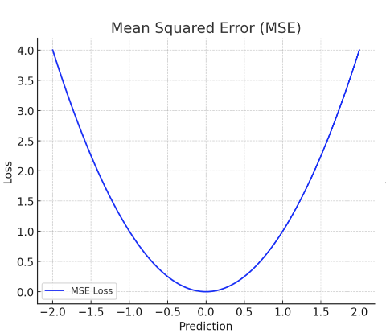
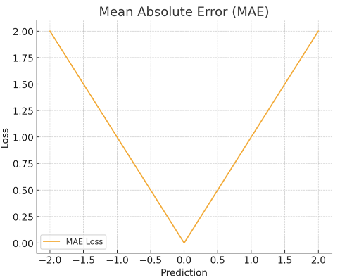
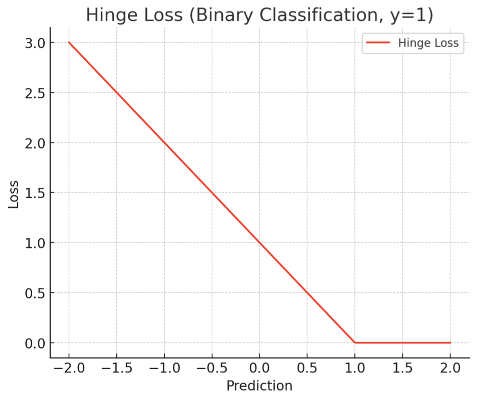
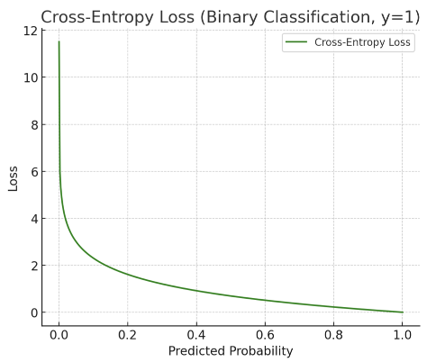

# 理解损失函数：机器学习中不可或缺的关键

## 1. 基本概念

在机器学习和深度学习的世界里，**损失函数（Loss Function）**扮演着至关重要的角色。它是模型学习过程中不可或缺的一部分，用来衡量模型的预测结果与真实值之间的差距。

### 1.1 定义
损失函数是一种数学工具，量化了模型预测结果 $\hat{y}$ 与真实标签 $y$ 之间的差异。损失越小，表明模型预测越准确；损失越大，说明模型需要进一步调整。

通常记作 $L(\hat{y}, y)$。

### 1.2 作用
损失函数的存在，为模型训练指明了优化方向。通过不断最小化损失函数的值，我们可以逐步提升模型的预测能力和泛化能力。

## 2. 四种常见损失函数详解与可视化

在机器学习与深度学习中，**损失函数（Loss Function）**是衡量模型预测结果与真实结果之间差异的重要工具。本文将系统讲解四种经典的损失函数，并通过可视化帮助理解它们的特点和适用场景。

### 2.1 回归任务中的损失函数

#### 2.1.1 均方误差（MSE，Mean Squared Error）

##### 定义
均方误差是预测值与真实值差异的平方和的平均：

$$
\text{MSE} = \frac{1}{n} \sum_{i=1}^n (y_i - \hat{y}_i)^2
$$

其中 $y_i$ 是真实值，$\hat{y}_i$ 是预测值。

##### 特点
- **对离群点敏感**：由于平方项，大误差被放大，适合需要强烈惩罚大误差的场景。
- **连续且可导**：适合用梯度下降等优化方法。

##### 应用范围
- 回归问题：如房价预测、温度预测、股票价格预测等。

##### 可视化

*图1：MSE损失函数曲线，呈现出光滑的抛物线形状，预测值越接近真实值，损失越小。*

#### 2.1.2 平均绝对误差（MAE，Mean Absolute Error）

##### 定义
平均绝对误差是预测值与真实值差异的绝对值的平均：

$$
\text{MAE} = \frac{1}{n} \sum_{i=1}^n |y_i - \hat{y}_i|
$$

##### 特点
- **对离群点不敏感**：相比 MSE，MAE 对单个极端错误不那么敏感。
- **不可导于0处**：在误差为0的位置不可导，优化可能较慢。

##### 应用范围
- 回归问题：尤其在需要对每个样本公平处理时（如中位数回归任务）。

##### 可视化

*图2：MAE损失函数曲线，呈现V型折线，误差线性增加。*

### 2.2 分类任务中的损失函数

#### 2.2.1 交叉熵损失（Cross-Entropy Loss）

##### 定义
常用于分类任务（二分类形式）：

$$
\text{Cross-Entropy} = -\left( y \log(\hat{y}) + (1 - y) \log(1 - \hat{y}) \right)
$$

其中 $y \in \{0,1\}$ 是真实标签，$\hat{y}$ 是预测的正类概率。

##### 特点
- **惩罚错误自信预测**：如果模型预测很自信但错误，损失会非常大。
- **适合概率建模**：自然适配 Softmax/Sigmoid 输出。

##### 应用范围
- 分类问题：如图片分类（猫狗识别）、情感分析（正面/负面）。

##### 可视化

*图3：交叉熵损失函数曲线，当预测概率接近真实值时损失很小，但当预测概率远离真实标签时损失急剧上升。*

#### 2.2.2 铰链损失（Hinge Loss）

##### 定义
多用于支持向量机（SVM）分类器：

$$
\text{Hinge} = \max(0, 1 - y \times \hat{y})
$$

其中 $y \in \{-1, 1\}$ 为标签，$\hat{y}$ 是预测值。

##### 特点
- **推崇间隔最大化**：不仅希望正确分类，还希望预测结果离决策边界远。
- **只关注支持向量**：正确且安全距离够远的样本对损失无影响。

##### 应用范围
- SVM模型：传统 SVM 使用 Hinge Loss。
- 最大间隔分类任务。

##### 可视化

*图4：铰链损失函数曲线，呈一条线性下降后水平保持在0的折线，预测值超过1后损失即为0。*

### 2.3 四种损失函数特点总结

下表总结了上述四种常见损失函数的关键特征：

| 损失函数 | 曲线形状 | 应用场景 | 对异常值敏感性 |
|---------|---------|----------|--------------|
| MSE | 平滑抛物线 | 回归问题 | 高 |
| MAE | V字折线 | 回归问题 | 低 |
| Cross-Entropy | 曲率变化剧烈 | 分类问题 | 高 |
| Hinge Loss | 折线 | 分类 (SVM) | 中 |

## 3. 直观理解

### 3.1 打靶比喻
想象把真实标签 $y$ 当作靶心，预测值 $\hat{y}$ 是扔出的飞镖。损失函数就是计算飞镖离靶心的远近，训练的过程就是反复练习，不断让飞镖更接近靶心。

## 4. 重要概念区分

### 4.1 损失函数 vs 代价函数
| 概念 | 定义 | 应用场景 |
|------|------|----------|
| 损失函数（Loss Function） | 一个样本的误差 | 单个样本评估 |
| 代价函数（Cost Function） | 所有样本误差的平均值 | 整体模型评估 |

> 通常在训练中，我们最小化的是整个训练集的代价函数。

## 5. 自定义损失函数

在实际应用中，如果标准损失函数不能满足需求，可以根据具体任务定义适合的损失函数，只要保证它可以进行梯度计算即可。

## 6. 总结

损失函数是机器学习模型训练的核心组件，它：
- 量化预测误差
- 指导模型优化方向
- 影响模型最终性能
- 可根据任务需求自定义

选择合适的损失函数对模型性能至关重要，需要根据具体任务类型和数据特点来决定。
