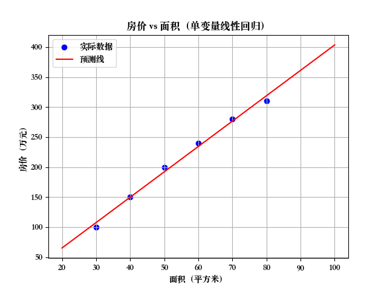
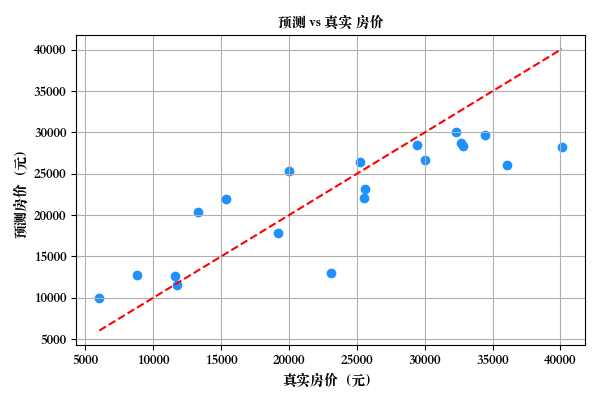
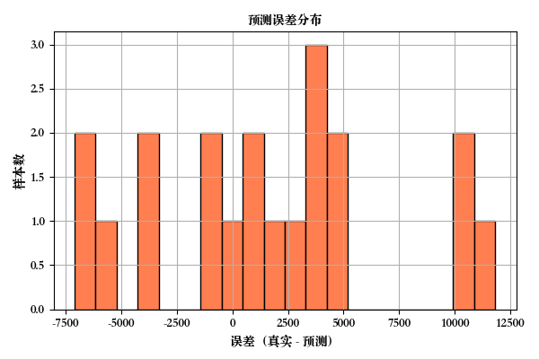
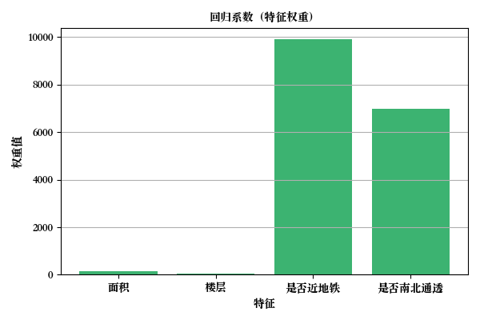

# 回归分析基础讲解与实战代码（附图表展示）

本文将详细讲解监督学习中的回归问题，特别是线性回归，包括其数学原理、编程实现以及如何通过图像分析模型表现，适合初学者快速入门，也适合有经验的开发者参考测试。

## 一、什么是回归？

在监督学习中，**回归**是一种用于预测连续值的方法。

通俗地说，就是：
> 给你一堆"输入-输出"的样本数据，让你学习出一个数学表达式，这个表达式能用来预测新数据的输出。

就像一句比喻：
> "给出了一堆数据和结果，然后推导出一个公式"——这就是回归的核心本质。

## 二、线性回归模型：单变量与多变量

### 2.1 线性回归的基本概念

线性回归是最基础也是最常用的回归分析方法。它通过建立因变量（预测目标）与自变量（特征）之间的线性关系来进行预测。

#### 数学表达式
线性回归的基本形式是：
\[ y = wx + b \]
其中：
- \( y \) 是预测值（因变量）
- \( x \) 是特征（自变量）
- \( w \) 是权重（斜率）
- \( b \) 是偏置项（截距）

#### 模型目标
线性回归的目标是找到最优的 \( w \) 和 \( b \)，使得预测值与真实值之间的误差最小。通常使用均方误差（MSE）作为优化目标：
\[ MSE = \frac{1}{n}\sum_{i=1}^n(y_i - \hat{y}_i)^2 \]
其中 \( y_i \) 是真实值，\( \hat{y}_i \) 是预测值。

### 2.2 单变量线性回归

#### 概念解释
单变量线性回归是最简单的线性回归形式，只使用一个特征（自变量）来预测目标值。

#### 特点
1. 只有一个自变量（特征）
2. 可以在二维平面上直观地表示为一条直线
3. 适合研究两个变量之间的简单线性关系

#### 应用场景
- 房价与面积的关系
- 销量与广告投入的关系
- 学习时间与考试成绩的关系

### 2.3 多变量线性回归

#### 概念解释
多变量线性回归使用多个特征来预测目标值，是单变量线性回归的扩展。

#### 数学表达式
\[ y = w_1x_1 + w_2x_2 + ... + w_nx_n + b \]
其中：
- \( x_1, x_2, ..., x_n \) 是不同的特征
- \( w_1, w_2, ..., w_n \) 是对应的权重
- \( b \) 是偏置项

#### 特点
1. 考虑多个影响因素
2. 可以捕捉更复杂的关系
3. 在高维空间中形成超平面

#### 应用场景
- 房价预测（面积、位置、楼层等多个因素）
- 销量预测（广告投入、季节、竞品价格等）
- 用户行为分析（年龄、收入、消费习惯等）

### 2.4 模型评估
线性回归模型的常用评估指标：

1. **R²分数（决定系数）**
   - 范围：0~1
   - 越接近1表示模型拟合越好
   - 计算公式：\[ R^2 = 1 - \frac{\sum(y - \hat{y})^2}{\sum(y - \bar{y})^2} \]

2. **均方误差（MSE）**
   - 越小越好
   - 计算公式：\[ MSE = \frac{1}{n}\sum_{i=1}^n(y_i - \hat{y}_i)^2 \]

3. **平均绝对误差（MAE）**
   - 越小越好
   - 计算公式：\[ MAE = \frac{1}{n}\sum_{i=1}^n|y_i - \hat{y}_i| \]

### 2.5 实践示例

#### 示例：房价 vs 面积
我们用一组简单的房价和面积数据，训练一个线性模型，预测房价。

#### 完整代码：
```python
import numpy as np
import matplotlib.pyplot as plt
from sklearn.linear_model import LinearRegression

# 构造数据
area = np.array([30, 40, 50, 60, 70, 80]).reshape(-1, 1)
price = np.array([100, 150, 200, 240, 280, 310])

# 建模
model = LinearRegression()
model.fit(area, price)

# 预测
area_pred = np.linspace(20, 100, 100).reshape(-1, 1)
price_pred = model.predict(area_pred)

# 可视化
plt.scatter(area, price, color='blue', label='实际数据')
plt.plot(area_pred, price_pred, color='red', label='预测线')
plt.xlabel('面积（㎡）')
plt.ylabel('房价（万元）')
plt.title('房价 vs 面积（单变量线性回归）')
plt.legend()
plt.grid(True)
plt.show()
```


### 2.6 多变量线性回归示例

#### 示例：房价 vs 面积 + 楼层

```python
from sklearn.model_selection import train_test_split

# 特征：面积、楼层
data = np.array([
    [30, 2], [40, 3], [50, 5], [60, 6], [70, 8], [80, 9]
])
price = np.array([100, 140, 190, 230, 280, 320])

X_train, X_test, y_train, y_test = train_test_split(
    data, price, test_size=0.2, random_state=42
)

model = LinearRegression()
model.fit(X_train, y_train)

# 模型系数和截距
print(f"系数: {model.coef_}")
print(f"截距: {model.intercept_}")

# 预测
predictions = model.predict(X_test)
print(f"预测值: {predictions}")
print(f"真实值: {y_test}")
```

## 三、误差分析和特征权重分析

### 3.1 误差分析（残差分析）

#### 概念解释
- **误差（残差）** = 真实值 - 预测值
- 理想情况下，误差应当近似于正态分布，且均值为0
- 如果误差有明显偏移、模式，说明模型拟合不佳，可能需要换模型或加入更多特征

#### 误差分析完整代码
```python
import numpy as np
import matplotlib.pyplot as plt
from sklearn.linear_model import LinearRegression
from sklearn.model_selection import train_test_split
import seaborn as sns
from sklearn.metrics import mean_squared_error

# 构造示例数据
data = np.array([
    [30, 2], [40, 3], [50, 5], [60, 6], [70, 8], [80, 9]
])
price = np.array([100, 140, 190, 230, 280, 320])

# 划分训练集和测试集
X_train, X_test, y_train, y_test = train_test_split(
    data, price, test_size=0.2, random_state=42
)

# 训练模型
model = LinearRegression()
model.fit(X_train, y_train)

# 预测和计算误差
predicted = model.predict(X_test)
residuals = y_test - predicted

# 绘制误差分布图
plt.figure(figsize=(10, 6))
sns.histplot(residuals, kde=True, bins=10, color='purple')
plt.title('预测误差分布图')
plt.xlabel('预测误差（真实值 - 预测值）')
plt.ylabel('频次')
plt.grid(True)
plt.show()

# 打印误差统计信息
print(f"平均误差: {np.mean(residuals):.2f}")
print(f"误差标准差: {np.std(residuals):.2f}")
print(f"均方误差(MSE): {mean_squared_error(y_test, predicted):.2f}")
```


### 3.2 特征权重分析（系数）

#### 概念解释
- 在线性模型中，每个特征的系数表示它对预测目标的"影响力"
- 系数越大（正负不重要），说明这个特征对预测结果越关键
- 可以用柱状图可视化权重大小

#### 特征权重分析完整代码
```python
import numpy as np
import matplotlib.pyplot as plt
from sklearn.linear_model import LinearRegression
from sklearn.model_selection import train_test_split

# 构造示例数据
data = np.array([
    [30, 2], [40, 3], [50, 5], [60, 6], [70, 8], [80, 9]
])
price = np.array([100, 140, 190, 230, 280, 320])

# 训练模型
model = LinearRegression()
model.fit(data, price)  # 这里使用全部数据训练，因为我们只关注特征权重

# 准备数据
features = ['面积', '楼层']
coefficients = model.coef_

# 创建特征权重可视化
plt.figure(figsize=(10, 6))
bars = plt.bar(features, coefficients, color=['teal', 'coral'])
plt.title('特征权重（回归系数）分析')
plt.ylabel('权重大小')
plt.grid(True, axis='y')

# 在柱状图上添加具体数值
for bar in bars:
    height = bar.get_height()
    plt.text(bar.get_x() + bar.get_width()/2., height,
             f'{height:.2f}',
             ha='center', va='bottom')

plt.show()

# 打印特征权重信息
print("特征权重分析:")
for feature, coef in zip(features, coefficients):
    print(f"{feature}: {coef:.2f}")
print(f"截距: {model.intercept_:.2f}")
```


### 3.3 综合分析完整代码
如果你想同时进行误差分析和特征权重分析，可以使用下面的完整代码：

```python
import numpy as np
import matplotlib.pyplot as plt
from sklearn.linear_model import LinearRegression
from sklearn.model_selection import train_test_split
import seaborn as sns
from sklearn.metrics import mean_squared_error

# 构造示例数据
data = np.array([
    [30, 2], [40, 3], [50, 5], [60, 6], [70, 8], [80, 9]
])
price = np.array([100, 140, 190, 230, 280, 320])

# 划分训练集和测试集
X_train, X_test, y_train, y_test = train_test_split(
    data, price, test_size=0.2, random_state=42
)

# 训练模型
model = LinearRegression()
model.fit(X_train, y_train)

# 1. 误差分析
predicted = model.predict(X_test)
residuals = y_test - predicted

# 创建子图
plt.figure(figsize=(15, 6))

# 误差分布图
plt.subplot(1, 2, 1)
sns.histplot(residuals, kde=True, bins=10, color='purple')
plt.title('预测误差分布图')
plt.xlabel('预测误差（真实值 - 预测值）')
plt.ylabel('频次')
plt.grid(True)

# 2. 特征权重分析
features = ['面积', '楼层']
coefficients = model.coef_

plt.subplot(1, 2, 2)
bars = plt.bar(features, coefficients, color=['teal', 'coral'])
plt.title('特征权重（回归系数）分析')
plt.ylabel('权重大小')
plt.grid(True, axis='y')

# 在柱状图上添加具体数值
for bar in bars:
    height = bar.get_height()
    plt.text(bar.get_x() + bar.get_width()/2., height,
             f'{height:.2f}',
             ha='center', va='bottom')

plt.tight_layout()
plt.show()

# 打印分析结果
print("误差分析:")
print(f"平均误差: {np.mean(residuals):.2f}")
print(f"误差标准差: {np.std(residuals):.2f}")
print(f"均方误差(MSE): {mean_squared_error(y_test, predicted):.2f}")

print("\n特征权重分析:")
for feature, coef in zip(features, coefficients):
    print(f"{feature}: {coef:.2f}")
print(f"截距: {model.intercept_:.2f}")
```
## 四、进阶探索

如果你想继续深入，可以探索以下主题：

1. **多项式回归**：处理非线性关系
2. **正则化方法**：
   - Ridge回归（L2正则化）
   - Lasso回归（L1正则化）
3. **模型评价指标**：
   - R²（决定系数）
   - MSE（均方误差）
   - MAE（平均绝对误差）
4. **可视化分析**：
   - 残差图
   - 预测-真实散点图
5. **特征工程**：
   - 高阶特征构造
   - 特征选择方法

## 参考资料

1. scikit-learn官方文档
2. Python数据科学手册
3. 机器学习实战

---

**注**：本文代码基于Python 3.8+和scikit-learn 1.0+版本。
