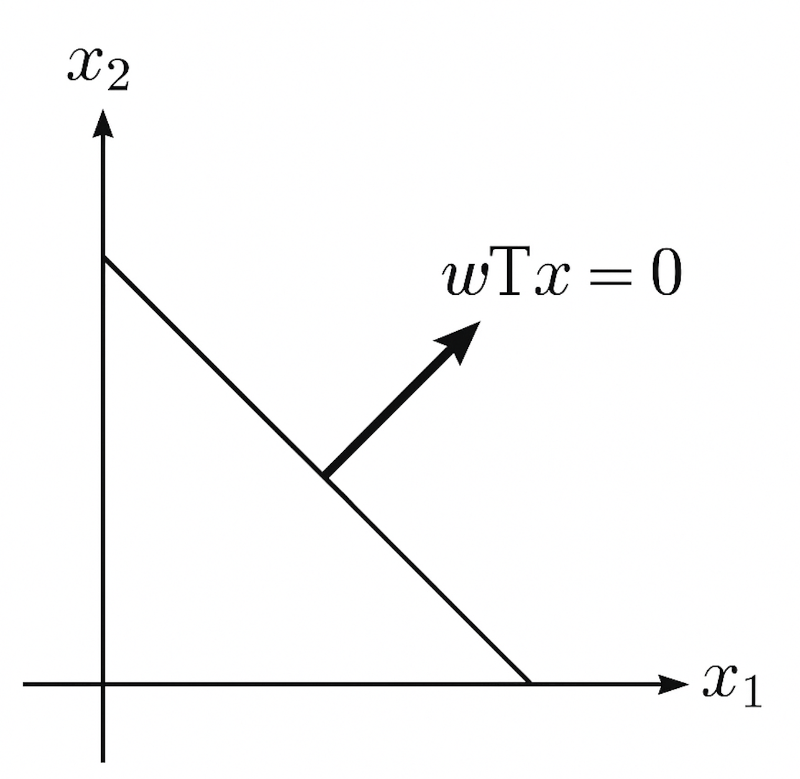
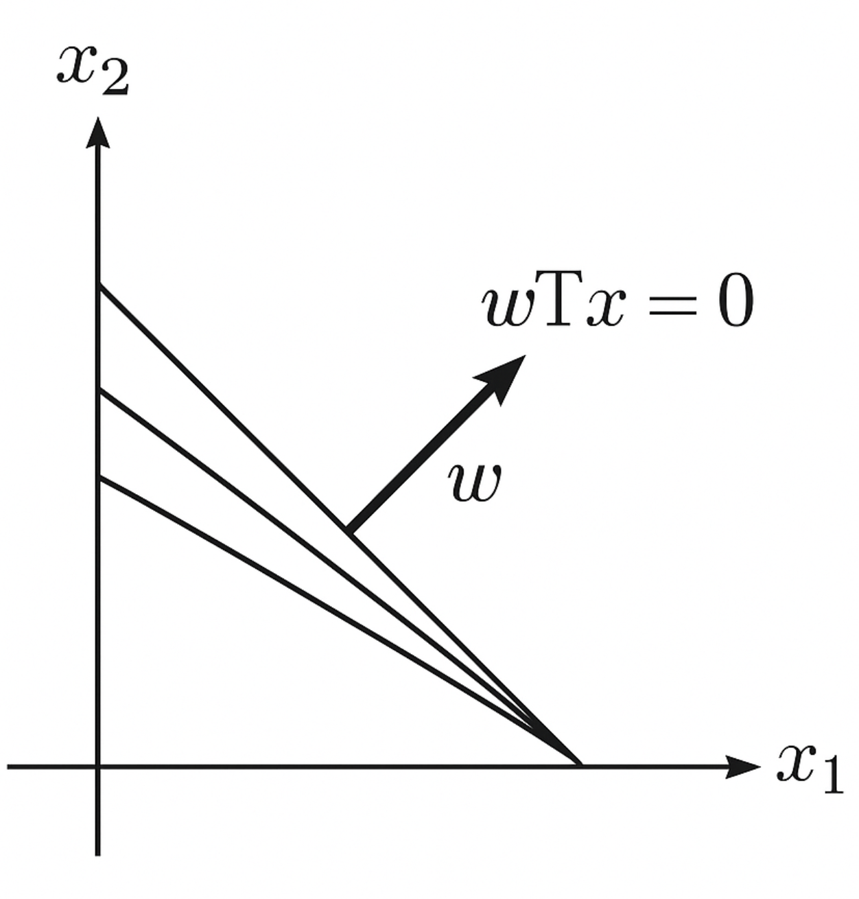

### 权重的数学意义与本质

**1. 权重的数学定义：**  
在数学中，"权重（weight）"是一种系数，表示一个值在整体中所占的重要程度。在加权求和、加权平均、线性组合等常见结构中，权重决定了每一项对结果的影响大小。例如，加权平均值的公式如下：

$$
\bar{x} = \frac{\sum_{i=1}^{n} w_i x_i}{\sum_{i=1}^{n} w_i}
$$

这里，\( x_i \) 是第 \( i \) 个样本，\( w_i \) 是其对应的权重。若所有权重相等，则公式退化为普通平均值。

**2. 权重的本质：线性代数视角**  
从线性代数的角度看，权重构成了一个向量，用于对输入向量进行线性变换。例如：

$$
y = \mathbf{w}^T \mathbf{x} = \sum_{i=1}^{n} w_i x_i
$$

这里 $\mathbf{w} \in \mathbb{R}^n \$ 是权重向量，$\mathbf{x} \in \mathbb{R}^n \ $是输入特征向量。这个点积运算实际上在投影 $\mathbf{x} \$ 到 $ \mathbf{w} \$ 方向，衡量两者的对齐程度。若权重是单位向量，则 $ y \$ 等于 $\mathbf{x} \$ 在该方向上的投影长度。

因此，从本质上看，权重体现了“对哪个方向敏感”，代表了模型对不同特征维度的重要性认知。

**3. 权重的几何意义：决策边界与法向量**

在二维空间中，权重向量与决策边界的关系可以用下图直观展示：

*图1：权重向量、决策边界与法向量的几何关系*

这张图是一个二维坐标系，横轴是 $ x_1 \$，纵轴是 $x_2 \$。图中有三样重要的元素：

1. **决策边界$\ w^T x = 0 \$**  
   - 黑色的斜线就是决策边界，它把整个平面分成了两部分。
   - 决策边界的方程是 \( w^T x = 0 \)，也就是 \( w_1 x_1 + w_2 x_2 = 0 \)。
   - 它代表模型“认为”两类样本分界的位置。

2. **权重向量 $\ w \$：**  
   - 从原点出发的一支粗箭头，指向右上方。
   - 它是决策边界的法向量（垂直方向）。也就是说，权重向量的方向跟决策边界是正交（90度）的。
   - 权重向量 $\( w = (w_1, w_2) \)$，其中 $\( w_1 \)$ 控制在 $\( x_1 \)$ 方向上的倾斜程度，$\( w_2 \)$ 控制在 $\( x_2 \)$ 方向上的倾斜程度。

3. **几何意义：**  
   - 权重向量 $\( w \)$ 的方向，决定了“哪一边是正类，哪一边是负类”。
   - 如果把某个点 $\( x \)$ 带入 $\( w^T x \)$：
     - 如果结果 > 0，说明点在箭头指向的一侧（比如正类）。
     - 如果结果 < 0，说明点在箭头反向的一侧（比如负类）。
   - 权重的模长 $\( \| w \| \)$（就是箭头的长度）影响的是：决策边界两边的斜率陡峭程度，也和模型对输入变化的敏感程度有关。

**简单总结：**
- 权重的方向决定了分类的方向；
- 权重的大小影响了分类面附近变化的敏感度（比如在 logistic 回归里对应决策曲线的陡峭程度）；
- 决策边界就是所有使 $\( w^T x = 0 \)$ 成立的点组成的直线。

**4. 权重方向与决策边界的动态关系**

为了更直观地理解“权重方向变化=决策边界旋转”，请看下图：

*图2：不同权重方向下的决策边界变化示意*

这张图是一个更完整的二维坐标系（$\( x_1 \)$-轴 和 $\( x_2 \)$-轴），包含：

1. **三条决策边界线（从原点发散出去的三条直线）：**
   - 它们分别对应不同方向的权重向量 $\( w \)$。
   - 每条线都代表一组权重下，模型学习到的决策边界 $\( w^T x = 0 \)$。
   - 三条线角度不同，说明权重方向变了，决策边界也跟着转动了。

2. **粗箭头表示的权重向量 $\( w \)$：**
   - 这支箭头指向介于中间的方向。
   - 它表示当前的权重向量 $\( w \)$，而与之垂直的那条直线就是对应的决策边界。
   - 注意：权重 $\( w \)$ 的方向总是和决策边界垂直，且箭头指向的是“模型预测为正类”的一侧。

3. **$\( w^T x = 0 \)$ 的标注：**
   - 标注在粗箭头正前方，强调这条对应于当前 $\( w \)$ 的决策边界是 $\( w^T x = 0 \)$。

**这张图想表达的核心内容是：**
- 权重向量 $\( w \)$ 决定了决策边界的朝向。
- 改变 $\( w \)$ 的方向，相当于旋转决策边界，就像图里展示的那样。
- 在训练神经网络时，通过调整权重的方向，模型在不停地“旋转”决策边界，以便更好地区分不同类别的数据。
- 权重越大，决策面附近的变化越敏感，边界也可以变得更“陡峭”。

---

**5. 权重与优化目标的关系**  
在机器学习中，权重是优化目标函数中的变量，通过优化（如最小化损失）来寻找一组最优的权重。这些权重体现了模型对输入特征的“选择性记忆”。

**6. 权重与概率的联系**  
在某些统计模型中，权重还可以解释为概率。例如在 softmax 分类器中，输入与权重的点积结果会通过指数函数和归一化，形成一组概率分布，体现每个类别的“权重”。

---

### 权重在生活中的应用

1. **成绩评定：**  
学期总成绩 = 作业成绩 × 20% + 期中考试 × 30% + 期末考试 × 50%。这里的 20%、30%、50% 就是不同环节的权重。

2. **决策打分：**  
在投标、人才选拔、风控等场景中，往往通过打分系统综合考虑多个因素（价格、能力、信用等），每个因素都有不同的权重。

3. **推荐系统：**  
用户行为（点击、收藏、购买）的权重不同，系统根据权重加总行为得分，判断用户是否感兴趣。

4. **问卷调查与统计分析：**  
不同群体（如年龄层、地区）在统计中可能被赋予不同的样本权重，以便结果更具代表性。

---

### 权重在神经网络中的应用

1. **权重作为学习参数：**  
在最基础的神经网络（如全连接神经网络）中，每一条连接边都有一个权重，表示输入特征对神经元输出的影响大小。神经元的输入是各输入特征乘以对应权重后的加权和：

$$
z = \sum_{i} w_i x_i + b
$$

其中 $\( w_i \)$ 是权重，$\( x_i \)$ 是输入特征，$\( b \)$ 是偏置项。

2. **权重的学习过程：**  
神经网络通过训练数据反复调整权重，使得输出尽可能接近目标值。这个过程依赖于损失函数和反向传播算法，权重在每次迭代中根据误差方向进行微调。

3. **权重的重要性：**  
权重决定了神经网络对输入特征的敏感程度，也塑造了网络的决策边界和拟合能力。不同的权重组合，定义了不同的函数映射能力，直接影响模型的准确率、泛化能力与复杂度。

4. **过拟合与权重规模：**  
如果权重过大，模型可能在训练集上表现很好但在测试集上过拟合。因此，常常需要对权重进行正则化（如 L2 正则化）来控制它们的大小，提高模型的泛化性能。

5. **初始权重的重要性：**  
神经网络训练通常从随机初始化的权重开始。初始权重的分布对训练过程是否顺利、是否能收敛到较好的结果有重要影响，因此有特定的初始化方法（如 Xavier 初始化，He 初始化）。

---

### 总结

权重是连接输入与输出、数据与模型、抽象与现实的桥梁。它既是数学中的重要概念，也是现实生活中决策与评估的工具，更是现代人工智能模型中不可或缺的核心参数。理解权重的本质，有助于我们更好地理解世界，也更好地构建模型来模拟世界。
